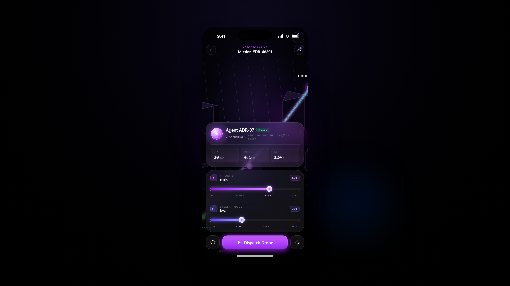
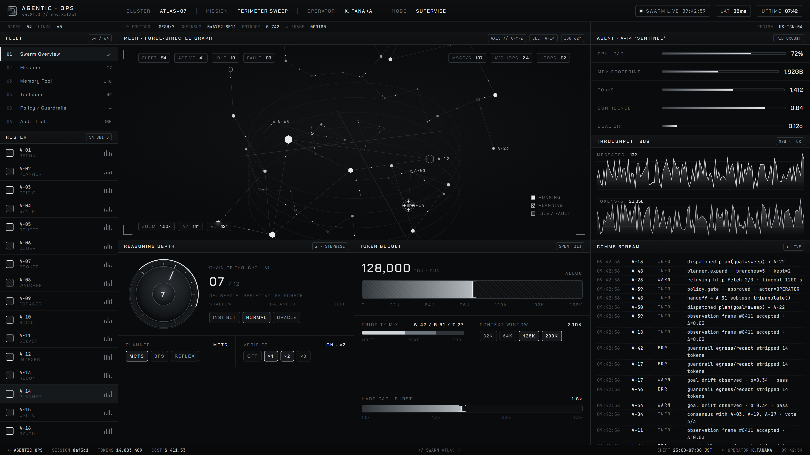
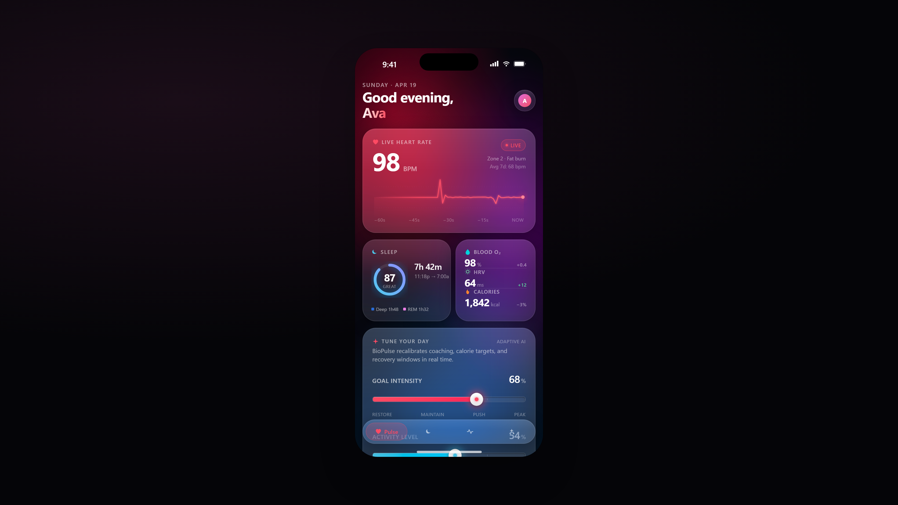
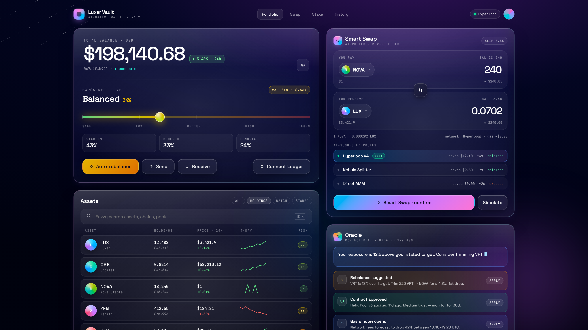
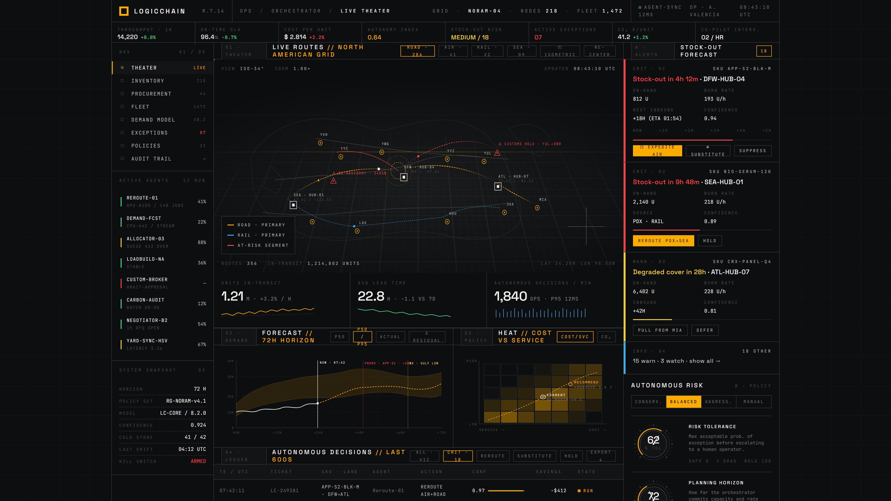
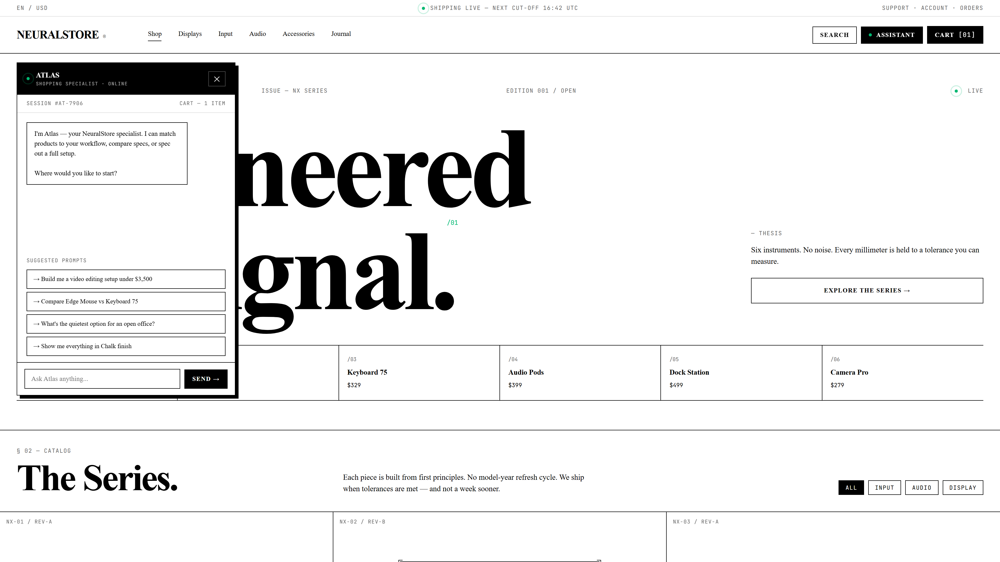
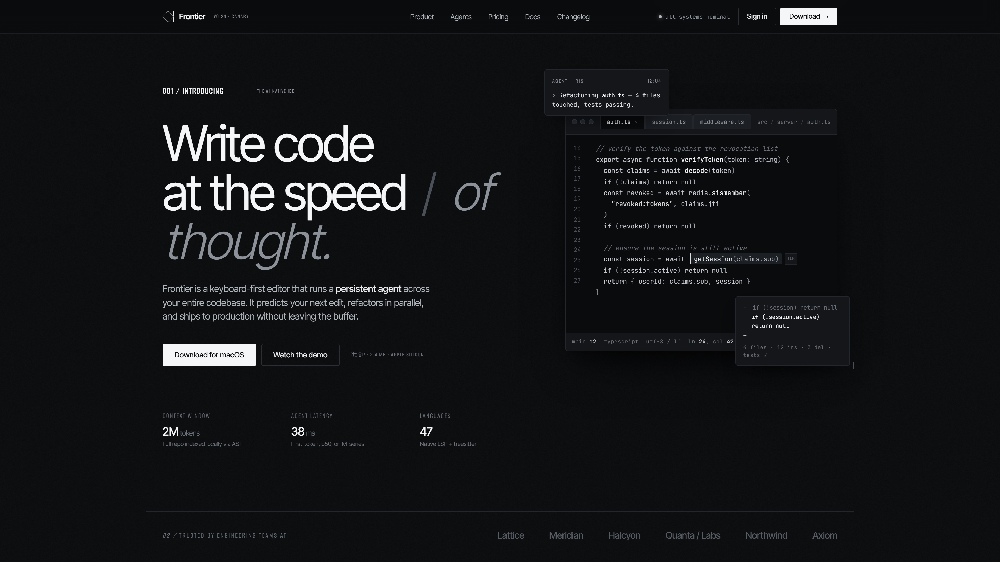
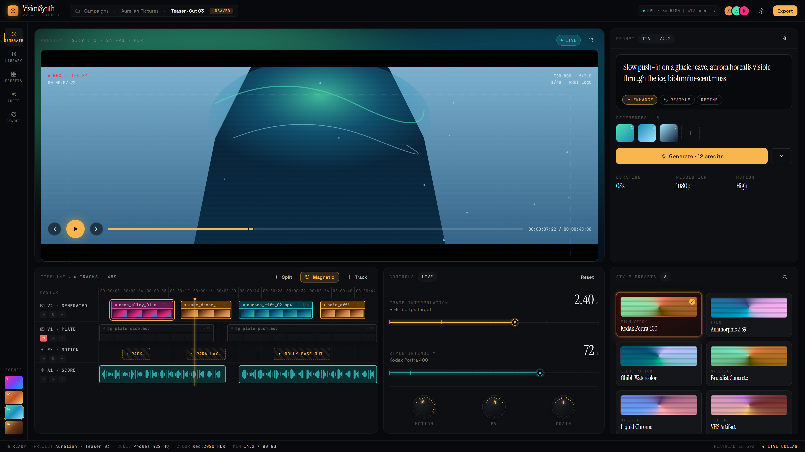

<div align="center">

# ⬡ Clawkit

### Stream production-grade UI designs directly into Claude Code — one command.

[](https://www.npmjs.com/package/clawkit)
[](https://github.com/miikeey1100/Claude-Design-Handoff-Vault/stargazers)
[](LICENSE)

</div>

---

## Magic Setup

```bash
npx clawkit use aerodrop | claude
```

That's it. Clawkit fetches the full HTML design, its design-token contract, and the original user intent — and pipes it into Claude Code as a structured implementation prompt.

```bash
# or with the -p flag
claude -p "$(npx clawkit use luxar-vault)"

# list all 8 bundles
npx clawkit list
```

---

## What is Clawkit?

Clawkit is a 30-line Node script that turns Claude Design handoff bundles into a community CDN for Claude Code. Every bundle ships with its full HTML prototype, design token family, and original user intent transcript. You get a **100% fidelity prompt** — not a vague description.

No build step. No framework lock-in. Pipe it, fork it, ship it.

---

## Bundle Gallery

| Preview | Bundle | Family | Fidelity | Command |
|---|---|---|---|---|
|  | **AeroDrop**<br>Autonomous AI Delivery | Liquid Glass | **98%** | `npx clawkit use aerodrop` |
|  | **Agentic Ops**<br>Swarm Console | Monochrome | **97%** | `npx clawkit use agentic-ops` |
|  | **BioPulse**<br>AI Health Tracker | Liquid Glass | **96%** | `npx clawkit use biopulse` |
|  | **Luxar Vault**<br>AI Crypto Wallet | Liquid Glass | **98%** | `npx clawkit use luxar-vault` |
|  | **Orchestrator**<br>LogicChain | Monochrome | **95%** | `npx clawkit use orchestrator` |
|  | **NeuralStore**<br>Engineered for Signal | Monochrome | **96%** | `npx clawkit use neuralstore` |
|  | **Frontier**<br>The AI-native IDE | Monochrome | **94%** | `npx clawkit use frontier` |
|  | **VisionSynth**<br>AI Video Generator | Liquid Glass | **97%** | `npx clawkit use visionsynth` |

### What is Fidelity Score?

Each score measures how completely a bundle's prompt covers the original design: color token coverage, radius/blur/spacing fidelity, layout accuracy, and interactive-state completeness versus the Claude Design prototype. **98% = every token and state accounted for.**

---

## Design Families

Every bundle belongs to one of two strictly-defined families. Mixing them is explicitly banned in [CLAUDE.md](CLAUDE.md).

| | Liquid Glass | Monochrome |
|---|---|---|
| Surface | `oklch(0.09 0.04 260)` + radial wash | `#0a0b0c` flat, hairline grids |
| Panel | `oklch(1 0 0 / 0.04)` + `blur(16px)` | `#111315`, no blur |
| Stroke | `oklch(1 0 0 / 0.10)` | `#23282d`, 1px |
| Type | SF Pro Display / Space Grotesk | Chakra Petch / Space Grotesk |
| Mono | JetBrains Mono | JetBrains Mono |
| Radius | 10 / 16 / 24 / 32 | 0–6 only |
| Accent | wash-driven, no single token | `#00b872` — one, earned |
| Baseline | 8px | 4px strict |

Full contract → [**CLAUDE.md**](CLAUDE.md)

---

## How it works

```
bundles/<slug>/project/*.html     ← prototype from claude.ai/design
        │
        ├── chats/chat1.md        ← the user's original intent
        │
        ▼
bin/clawkit                       ← fetches both from GitHub raw, builds prompt
        │
        ▼
stdout → claude                   ← Claude Code implements pixel-perfectly
        │
        ▼
previews/<slug>.png               ← 1920×1080 @2x, captured by Playwright
```

---

## ⭐ Star for Grant

Running 8 (soon 32) design bundles on GitHub raw as a community CDN isn't free forever. We're applying for Anthropic's OSS grant to keep this free and add:

- CLI auto-update when new bundles drop
- `npx clawkit new` to export your own Claude Design bundle
- GitHub Action to auto-regenerate previews on push

**Goal: 5,000 stars → grant application.**

[**⭐ Star this repo now**](https://github.com/miikeey1100/Claude-Design-Handoff-Vault/stargazers) — every star is a vote to keep the CDN free.

---

## Contributing a Bundle

1. Export from [claude.ai/design](https://claude.ai/design) → drop into `bundles/<slug>/`.
2. Pick a family (Liquid Glass or Monochrome) — see [CLAUDE.md](CLAUDE.md).
3. Add a row to `BUNDLES` in `bin/clawkit` and `scripts/capture.mjs`.
4. `npm run capture` — commit the new 1080p PNG.
5. Add a row to the gallery table above.
6. Open a PR.

---

<div align="center">

MIT licensed · designs by [claude.ai/design](https://claude.ai/design) · CLI by [miikeey1100](https://github.com/miikeey1100)

[**npx clawkit list**](https://github.com/miikeey1100/Claude-Design-Handoff-Vault) · [CLAUDE.md](CLAUDE.md) · [marketing/](marketing/)

</div>
