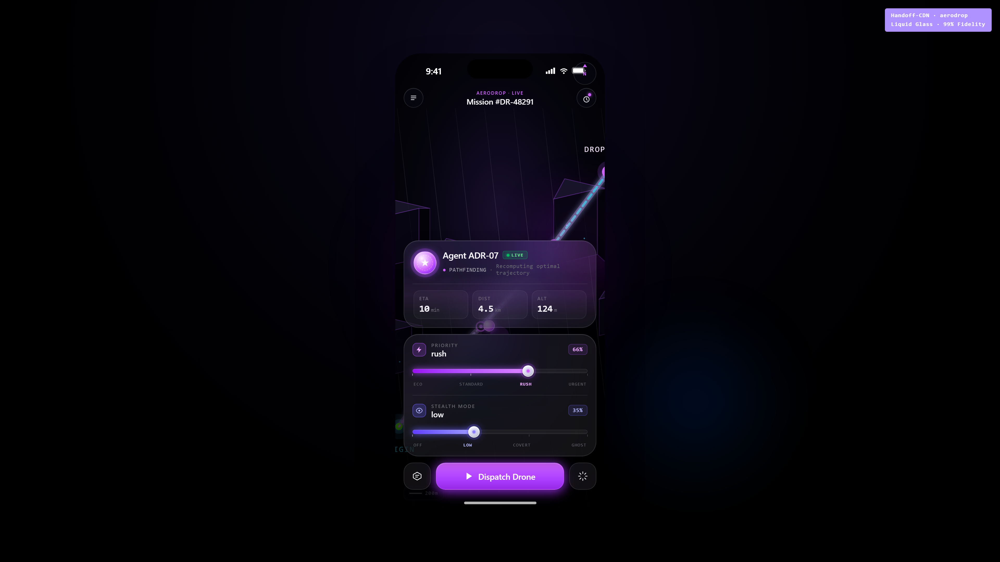
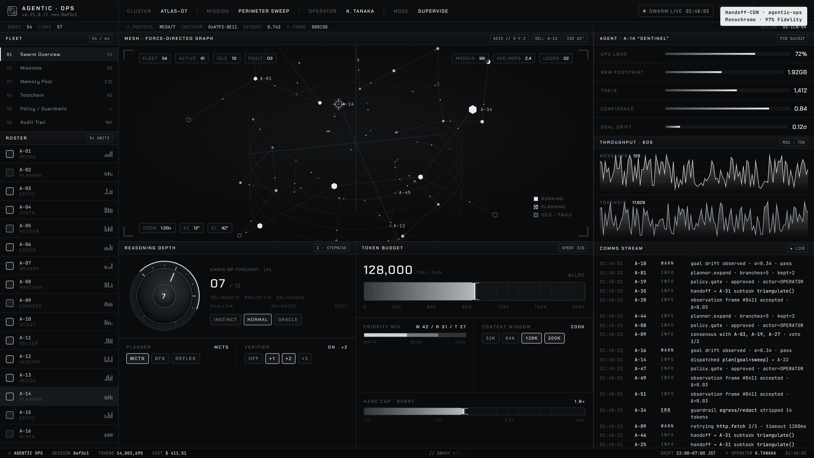
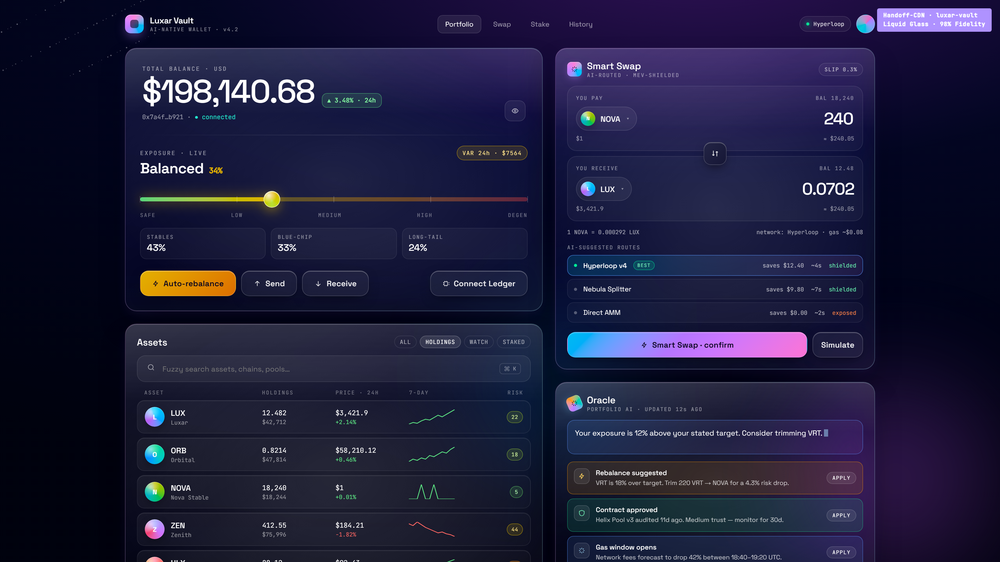
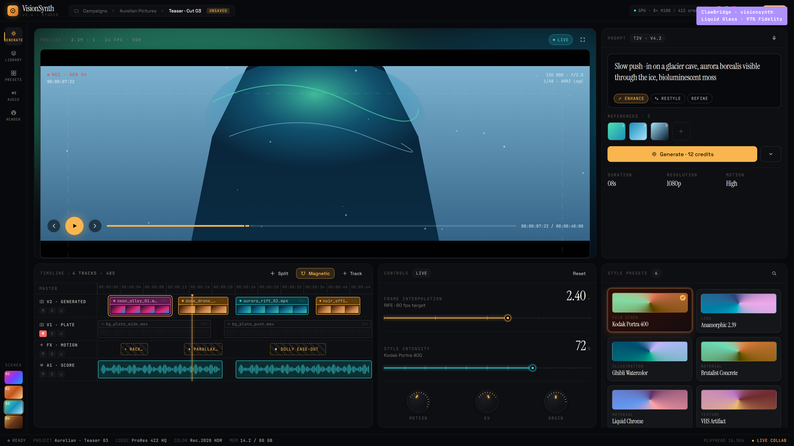

<div align="center">

<br>

# Stop describing UIs to AI.<br>Give it the design instead.

<br>

**Handoff-CDN** is a free, open-source library of production-grade UI prototypes —  
each one packaged as a single command that pipes a complete design brief into any AI coding tool.

<br>

[](https://www.npmjs.com/package/handoff-cdn)
[](https://github.com/miikeey1100/Claude-Design-Handoff-Vault/stargazers)
[](LICENSE)

<br>


<br>

```bash
npx handoff-cdn use aerodrop | claude
```

<br>

</div>

---

## The problem

You ask AI to build a UI. It gives you generic gray boxes with placeholder text and wrong fonts.

Not because AI can't code — because **it has nothing real to work from.**

Describing a design in words loses 90% of it. Figma exports are dev-only. No one has solved the brief → code gap.

---

## The fix

Handoff-CDN gives AI a **working HTML prototype + the original design intent + the full token contract** — all in one piped command.

```
Your words → vague output
A Handoff-CDN bundle → pixel-accurate implementation
```

Each bundle contains:
- A **self-contained HTML/CSS/JS prototype** (the actual design, running in a browser)
- The **original user intent transcript** (what the designer was thinking)
- A **design token contract** (exact colors, radii, blur, spacing — no approximations)
- A **directive** that locks the AI to the spec and blocks token drift

The AI doesn't guess. It executes.

---

## Before / After

**Before** — asking AI from scratch:

> "Build me a dark dashboard with a sidebar, some cards, and a green accent"

→ Bootstrap-gray layout. Wrong fonts. `#22c55e` instead of `#00b872`. Border-radius 8px where spec says 4px. Generic.

**After** — with a Handoff-CDN bundle:

```bash
npx handoff-cdn use agentic-ops | claude
```

→ `#0a0b0c` base. Chakra Petch headers. 4px baseline grid. `#00b872` one accent, never decorative. Every 1px hairline in place.

The diff is not about AI capability. It's about **what you give it**.

---

## Quick start

```bash
# List all bundles
npx handoff-cdn list

# Pipe a design into Claude
npx handoff-cdn use aerodrop | claude

# Pipe into any AI (ChatGPT, Cursor, etc.)
npx handoff-cdn use luxar-vault > brief.txt
# paste brief.txt into your AI of choice

# Inspect bundle metadata
npx handoff-cdn info visionsynth

# Install as a permanent project skill
npx handoff-cdn skill install
```

Works with **Claude Code, Cursor, ChatGPT, Gemini, Copilot** — any tool that accepts text input.

---

## Example output

Running `npx handoff-cdn use aerodrop` streams:

```
══════════════════════════════════════════════════════
  Handoff-CDN · aerodrop · v1.0
  AeroDrop — Autonomous AI Delivery Network
  Family: Liquid Glass  ·  Tokens: 47  ·  CDN: GitHub Raw
══════════════════════════════════════════════════════

## Original Design Intent
[60 lines from the designer's actual session transcript]

## Token Contract (enforced — do not approximate)
--glass-bg-0:  oklch(0.09 0.04 260)   ← not #0a0f1a
--glass-panel: oklch(1 0 0 / 0.04)    ← not rgba(255,255,255,0.04)
--blur-md:     16px                   ← not 12px, not 20px
--radius-lg:   24px                   ← not 20px, not 1.5rem
[full token block]

## Primary Design File: AeroDrop.html
[complete HTML source — self-contained, 27KB]

## Implementation Directive
You are implementing a Handoff-CDN bundle. Rules:
- Pixel-accurate fidelity is the only acceptable outcome
- Preserve all oklch() values — converting to hex breaks the spec
- Match every border-radius, blur, spacing, and type token exactly
- Do not simplify, omit, or "improve" the design
```

---

## Bundle Registry

### Flagship — 4 Elite Bundles

| Preview | Bundle | Design Family | Command |
|---|---|---|---|
|  | **AeroDrop**<br><sub>Autonomous AI delivery network · iOS frame · 3D map · glass agent cards</sub> | Liquid Glass | `npx handoff-cdn use aerodrop` |
|  | **Agentic Ops**<br><sub>AI swarm orchestration console · live agent grid · terminal log</sub> | Monochrome | `npx handoff-cdn use agentic-ops` |
|  | **Luxar Vault**<br><sub>AI-native crypto wallet · smart swap interface · glass panels</sub> | Liquid Glass | `npx handoff-cdn use luxar-vault` |
|  | **VisionSynth**<br><sub>AI video generation studio · timeline · glass cards · model selector</sub> | Liquid Glass | `npx handoff-cdn use visionsynth` |

### Extended Library — 4 More Bundles

| Bundle | Design Family | Command |
|---|---|---|
| **BioPulse** — AI health & vitals tracker | Liquid Glass | `npx handoff-cdn use biopulse` |
| **NeuralStore** — AI-specialist e-commerce | Monochrome | `npx handoff-cdn use neuralstore` |
| **Orchestrator** — Logic chain workflow builder | Monochrome | `npx handoff-cdn use orchestrator` |
| **Frontier** — AI-native IDE interface | Monochrome | `npx handoff-cdn use frontier` |

---

## Design families

Every bundle belongs to exactly one of two token families. The AI enforces this automatically.

### Liquid Glass
Frosted surfaces. oklch depth. Backdrop blur. 10–32px radii.  
**Used by:** AeroDrop · Luxar Vault · VisionSynth · BioPulse

### Monochrome
Silver-ink ladder. 4px baseline. Hairline grids. One accent — `#00b872` — never decorative.  
**Used by:** Agentic Ops · Orchestrator · NeuralStore · Frontier

Mixing families in one project is explicitly banned. The token contract enforces it.

---

## How it works

```
1. FETCH    npx handoff-cdn pulls the bundle from GitHub Raw (zero install)
2. BUILD    CLI assembles: intent transcript + token contract + full HTML + directive
3. PIPE     Structured prompt streams to your AI — it implements, not interprets
```

No accounts. No API keys. No build step. No runtime dependencies.  
The CLI is 200 lines of Node built-ins. [Read it.](bin/handoff-cdn.js)

---

## Contribute a bundle

Have a Claude Design export? Add it.

```bash
git clone https://github.com/miikeey1100/Claude-Design-Handoff-Vault
# drop your bundle under bundles/<slug>/
# add entry to manifest.json
# npm run capture && npm run compare
# open a PR
```

Full guide: [CONTRIBUTING.md](CONTRIBUTING.md)

**Rule:** one family per bundle. No mixing. A PR with mixed tokens gets closed.

---

## ⭐ Star this

If Handoff-CDN saves you an hour of prompt-wrestling, star it.

Stars help surface this to the developers who need it — and fund the next 24 bundles.

**[⭐ Star on GitHub](https://github.com/miikeey1100/Claude-Design-Handoff-Vault)**

---

<div align="center">

MIT · built by [miikeey1100](https://github.com/miikeey1100) · designs from [claude.ai/design](https://claude.ai/design)

[manifest.json](manifest.json) · [CLAUDE.md](CLAUDE.md) · [SKILL.md](SKILL.md) · [CONTRIBUTING.md](CONTRIBUTING.md)

</div>
